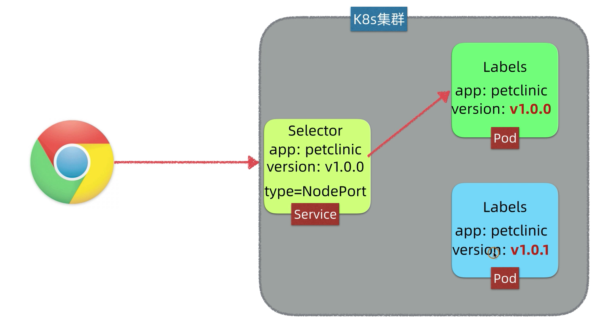
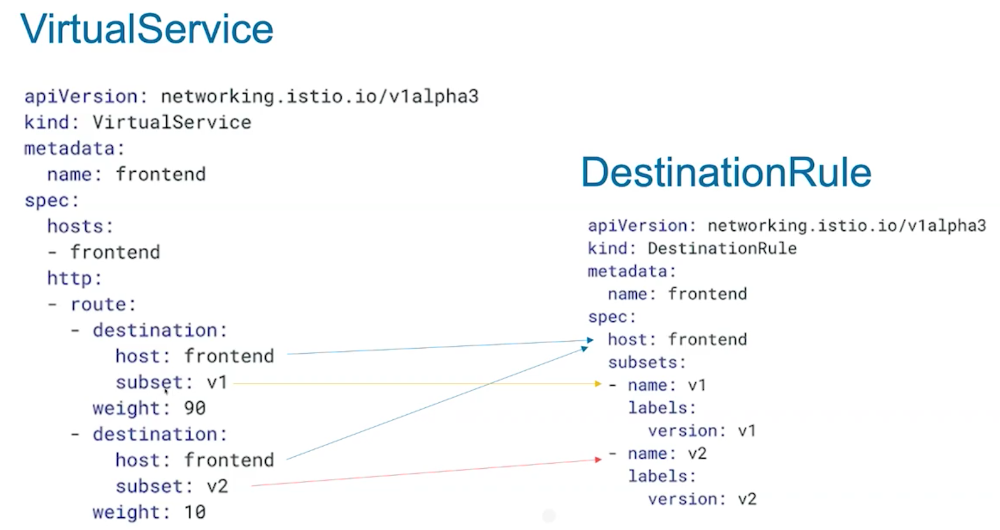

# 金丝雀发布、蓝绿发布、A/B Test

-----

## 蓝绿发布
  - 可以瞬间将流量导入到新版本，也可以瞬间回退到旧版本
  - 也就是说，在运行v1版本的时候同时部署上一套v2，然后一次性将v1的流量切换到v2
  - 优点是无感知，同时可以回滚，但是成本大，需要一倍以上的机器
  - k8s中首先通过label标签中加入version，然后开始的service的选择器是指向1版本
  - 然后将新版本2上线，之后改变service的selector到版本2（nginx也可以通过控制流量来做到蓝绿发布，但是较为繁琐）

## 金丝雀发布（灰度发布）：
  - 上线一个预览版本，先把少部分比如百分之5的流量导入预览版本，让一部分的先使用预览版本以进行测试。
  - 好处：1、通过将流量定向到多个版本来支持横向拓展，2、不必担心因发布新版本导致大面积瘫痪
也就是逐渐将流量从旧版本过渡到新版本。
  - 如果对新版本的数据做收集并且和旧版本做比较的话，就叫ABtest
### 使用istio的流量管理功能:

## 滚动发布：
  - 类似灰度发布，就是先启动一小部分的新版本，然后再干掉一小部分的旧版本，之后再启动一点新版本，再停一些旧版本，直到全部过渡。
  - 但是滚动发布由于会停止掉旧版本，并且无法确定流量的流向，所以除了问题无法确定是新版本还是旧版本出的问题，所以就有灰度发布。或者说灰度发布就像是带有流量控制的滚动发布。

