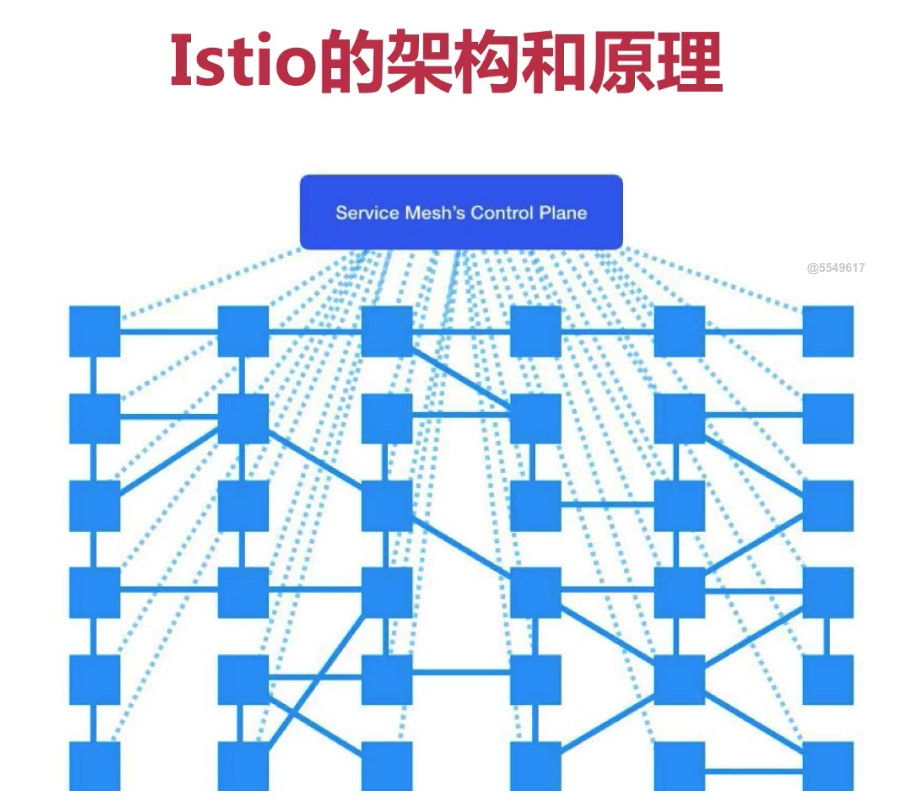
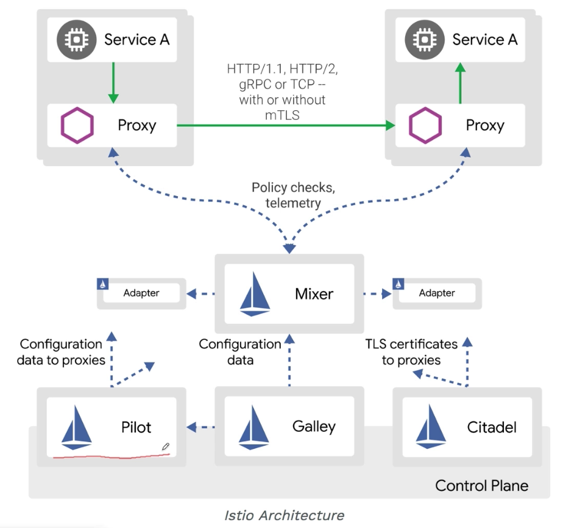
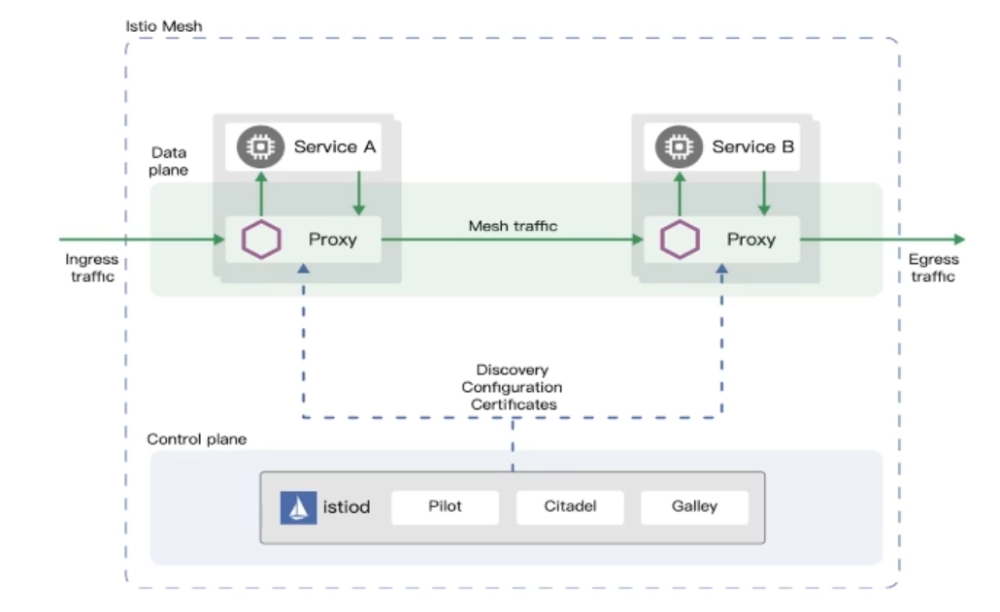
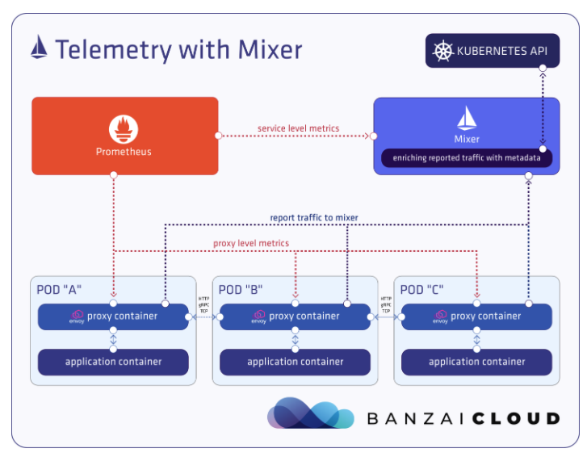
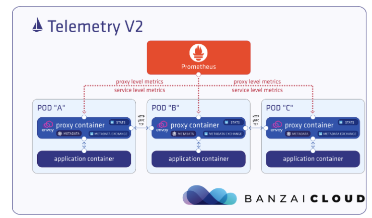

# istio
------------
  - 官网: istio.io/zh
------------

## istio架构和原理
核心就是一个代理，k8s集群中的每个pod中都多加入一个代理，利用了pod中容器共享网络的机制 
服务的进出流量都经过代理，代理就能对流量进行管理，除此之外还有个一个队代理统一管理的组件 
每个组件都被上面的控制中心管理 

### 1.1架构图

  1. 每个pod中都放了一个Proxy，这个Proxy是使用了c++开发的Envoy作为高性能的服务代理工具。
  2. Envoy提供了服务发现、负载均衡、流量管理等功能，以它作为pod中的sidecar。
  3. Pilot是管理Envoy的东西，负责给Envoy提供一些信息，比如告诉它集群需要哪些服务，告诉它哪些pod需要多少流量，它就能做ab测试，蓝绿发布等，以及多长时间超时，多长时间重试等。用户可以用Pilot做配置,然后Pilot会转换成Envoy可以识别的信息，然后分发给Envoy，最后达到期望。
  4. Mixer，主要用来定制一些策略还有遥测，为整个集群执行一些策略，比如哪些用户可以访问哪些服务，还比如哪些服务最多只能接收多少qps的服务，多了就扔掉等限制。这些策略都通过k8s配置文件完成的。然后遥测的话，它会从Proxy也就是Envoy中收集服务之间数据流转的数据，比如请求从哪儿发出来的，发出来到哪里，什么协议，延时，状态码等之类的。然后会把这些数据汇报给Adapter，每个数据对象都会有一个对应的适配器，比如像普罗米修斯就是个适配器。
  5. Galley，用来校验各种配置是否正确，目的是将istio的组件配置与具体的平台比如k8s隔离开。Citadel，主要功能是安全相关的，可以为用户→服务，服务→服务之间提供一些安全的通信，可以把http服务无感知地升级为https，包括rpac的访问控制等。

## istio解决的问题
  1. 由于把一个应用拆分成多个微服务了之后，中间各种服务之间相互调用，就可能会出现以下的各种问题
    > * 请求失败，需要知道请求是在哪个服务的时候出错了，是否A服务调用到了B服务
    > * 请求hang住，哪个服务hang住
    > * 整个链路相应慢，哪个服务出了问题导致的慢，哪些服务是串行哪些是并行的
  2. 另外还需要有一定的容错性
    > * 比如没有正确配置服务的超时参数，就会导致长时间无响应
    > * 因为某些原因导致了偶发的问题的话，需要重试机制
    > * 某些节点异常，比如某个节点的访问量增加，就需要智能地避开
  3. 应用的升级发布
    > * 新版本如果一次性升级发布，出了问题的话影响会很大
    > * 可以使用A/B test去根据用户属性访问不同的版本，从而得到更好的版本
    > * 还有发布新的API时候，希望不同版本的 API 可以访问到不同的应用等
  4. 系统安全
    > * 为了保证安全，每个应用都需要实现一套相同的安全认证
    > * 限流机制，不能让任何人无限制地访问

### 1.5架构图

  1. 把原来的pilot、咖喱、citadel整合到了一个叫做 istiod 的服务中
  2. 把 Mixer 给废了
  3. 增加了 istioctl，可以更好地运维 istio 平台
  4. 增加了 telemetry v2，替代 mixer 里的遥测能力
  5. 增加了对虚拟机的支持

1.5之前的版本，是mixer采集到service相应的数据之后在发给普罗米修斯 

1.5之后的版本，envoy加入了几个新功能，一个是加入了webassmebly插件，第二个是进出到envoy里面的流量的指标
都会被envoy的一个新插件检测到，然后再发送给普罗米修斯进行遥测 

