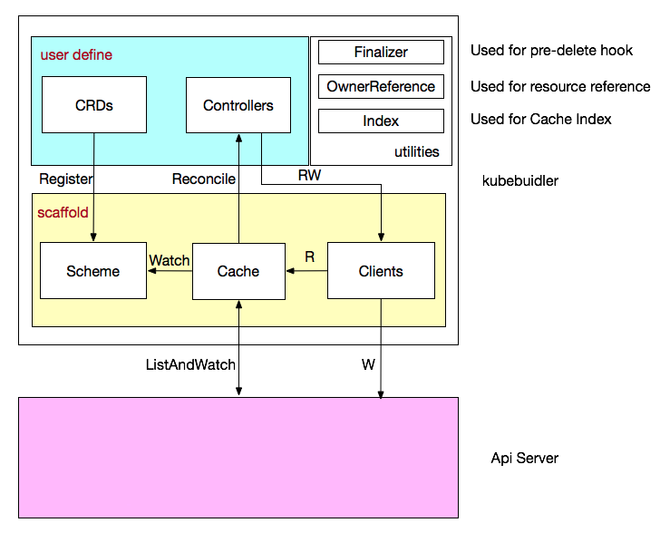

# Kubebuilder笔记

-----

## kubebuilder 作用
- 提供脚手架工具初始化 CRDs 工程，自动生成 boilerplate 代码和配置
- 提供代码库封装底层的 K8s go-client

## kubebuilder整体流程

1. 用户自定义crd，将自定义的crd注册到scheme中，这样通过GVK能找到对应的go的struct，也能通过go的struct找对对应的GVK
2. Cache监听Scheme中的GVK，同时和Api Server简历list-watch的连接
3. 当发现某个controller需要的GVK资源发生状态的改变就reconcile调度对应的controller
4. 对应的controller中是用户自己定义的逻辑，用来保证该类型的crd和k8s集群中声明的该资源的yaml/json中的字段一致
5. 保证一致主要是通过调用Clients，然后Clients可以和Api Server交互

