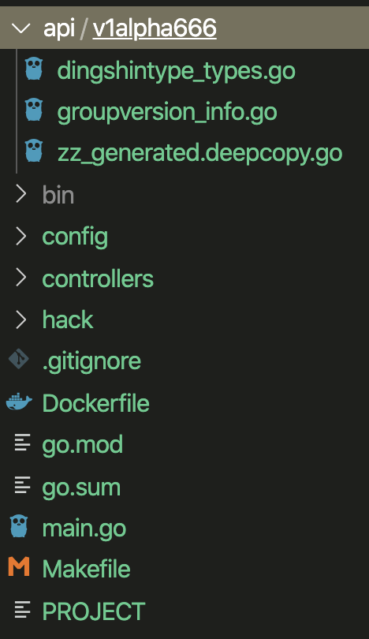
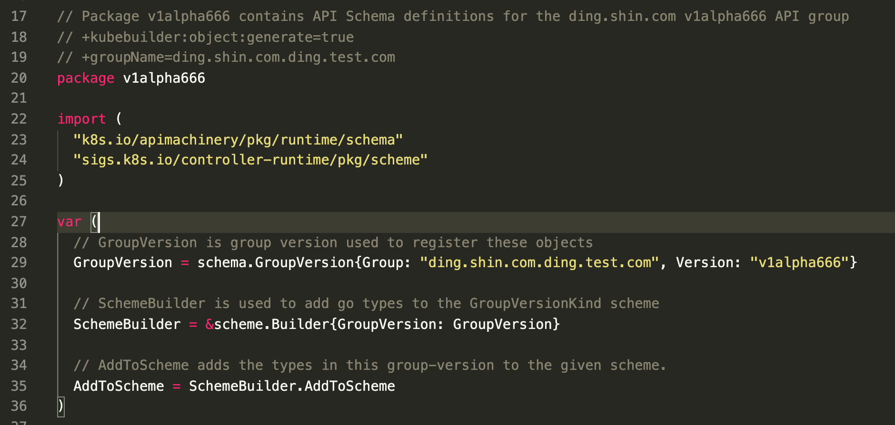
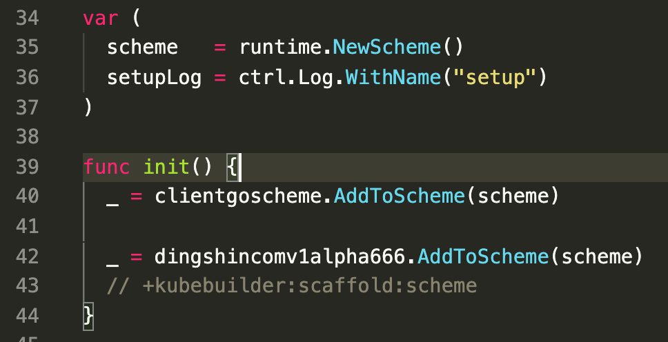
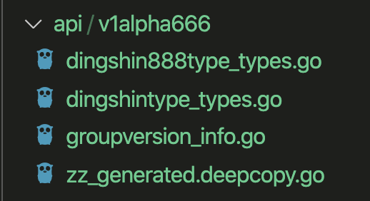

# Kubebuilder笔记

-----

## kubebuilder 作用
- 提供脚手架工具初始化 CRDs 工程，自动生成 boilerplate 代码和配置
- 提供代码库封装底层的 K8s go-client

## kubebuilder整体流程


1. 用户自定义crd，将自定义的crd注册到scheme中，这样通过GVK能找到对应的go的struct，也能通过go的struct找对对应的GVK
2. Cache监听Scheme中的GVK，同时和Api Server简历list-watch的连接
3. 当发现某个controller需要的GVK资源发生状态的改变就reconcile调度对应的controller
4. 对应的controller中是用户自己定义的逻辑，用来保证该类型的crd和k8s集群中声明的该资源的yaml/json中的字段一致
5. 保证一致主要是通过调用Clients，然后Clients可以和Api Server交互


## 使用方法
1. 初始化脚手架
这不创建了一个项目模板并引入一些依赖
```bash
kubebuilder init --domain ding.test.com
```
2. 创建api
会在根目录下创建一个api目录
里头有:
resourcename_types.go、groupversion_info.go、
zz_generated.deepcopy.go

```bash
kubebuilder create api --group ding.shin.com --version v1alpha666 --kind DingShinType
```
groupversion_info.go: 会声明 GroupVersion、SchemeBuilder、AddToScheme三个东西(也可以手动给改到别的文件引入)

每当再执行一遍craete api 如:
```bash
kubebuilder create api --group ding.shin.com --version v1alpha666 --kind DingShin888Type
```
就会多生成一个xxxxx_type.go</br>
不同的自定义CRD需要调用 SchemeBuilder.Register 注册自己以及一个 list</br>
之后在程序入口要将自定义的 CRD 们添加到 build-in(原生k8s的资源) 资源里面，
这样Cache就知道应该去Watch谁了</br>
在程序的入口处，除了把自定义的 CRD 添加到 scheme 中，还需要使用 manager 初始化资源，如:
```go
  // 1、init Manager
	mgr, err := ctrl.NewManager(ctrl.GetConfigOrDie(), ctrl.Options{Scheme: scheme, MetricsBindAddress: metricsAddr})
	if err != nil {
		setupLog.Error(err, "unable to start manager")
		os.Exit(1)
	}
```
```go
  // 2、init Reconciler（Controller）
  // 主要吧Clien Log Scheme 等依赖传进去
	err = (&controllers.ApplicationReconciler{
		Client: mgr.GetClient(),
		Log:    ctrl.Log.WithName("controllers").WithName("Application"),
		Scheme: mgr.GetScheme(),
	}).SetupWithManager(mgr)
	if err != nil {
		setupLog.Error(err, "unable to create controller", "controller", "EDASApplication")
		os.Exit(1)
  }
  
  // 3、调用 SetupWithManager 方法初始化Reconciler
  func (r *DingShin888TypeReconciler) SetupWithManager(mgr ctrl.Manager) error {
    return ctrl.NewControllerManagedBy(mgr).
      For(&dingshincomv1alpha666.DingShin888Type{}).
      Complete(r)
  }
```
也可以自定义setup方法去初始化，如:
```go
func VolumeMounterSetup(mgr ctrl.Manager, l logr.Logger) error {
	name := "sage/" + strings.ToLower(sagecorev1alpha2.VolumeMounterTraitGroupKind)
	return ctrl.NewControllerManagedBy(mgr).
		Named(name).
		For(&sagecorev1alpha2.VolumeMounterTrait{}).
		Complete(
		NewVolumeMounterTraitReconciler(mgr,
				core.WithLogger(l.WithValues("controller", name)),
				core.WithRecorder(event.NewAPIRecorder(mgr.GetEventRecorderFor(name)))))
}

// 里面主要得把 Scheme 以及 Client 和 Record 都传进去
func NewVolumeMounterTraitReconciler(m ctrl.Manager, o ...core.ReconcilerOption) *VolumeMounterTraitReconciler {
	it := &VolumeMounterTraitReconciler{}
	it.Client = m.GetClient()
	it.Scheme = m.GetScheme()
	it.Record = event.NewNopRecorder()
	for _, ro := range o {
		ro(&it.Reconciler)
	}
	it.traitBuilder = sagetrait.NewVolumeMounterTraitBuilder(it.Client, it.Log)
	gc := sagegc.GarbageCollector{
		Client: m.GetClient(),
		Log:    it.Log,
	}
	it.GC = gc

	return it
}
```


同时在 zz_generated.deepcopy.go 文件中也会对新的api创建对应的 deepcopy 相关的函数(对runtime.Object的interface的实现)</br>
另外 config 目录下的 crd 目录下的 yaml 们是对要创建的crd资源的描述</br>
controllers 目录下是 自定义的 Kind 的 controller


