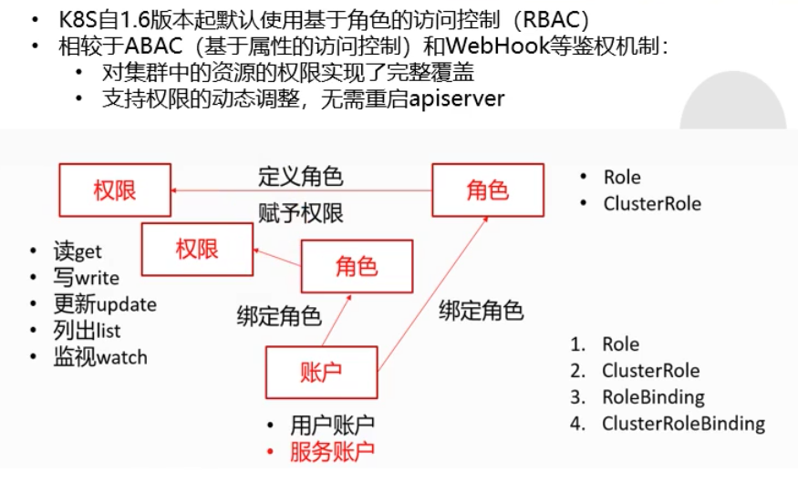

# RBAC (基于角色的访问控制)
---

  - .kube/config 是k8s用户账户的配置文件，或者说就是kubectl的配置文件，kubectl就是一个用户账户
  - 无法直接给某个账户(用户)xx权限，只能给用户账户或服务账户绑定相应的角色，然后再给角色赋予相应的权限
  - 角色有两种: Role（只能应用于固定的命名空间下）、ClusterRole（对集群所有命名空间都有效）
  - 绑定角色也有两种: RoleBinding、ClusterRoleBinding
  - 只要运行在k8s集群中的pods，就一定有一个服务账户(serviceAccount, -o yaml 之后能看到, 如果没有指定是谁，就会是默认的default， serviceaccount也是一种资源)

---
  - 用户账户：比如kubectl
  - 服务账户：比如pod，pod如果想获取集群中的一些资源的话，就必须绑定对应的服务账户

---
RBAC流程:</br>
  1. 创建一个账户(用户账户或服务账户)
  2. 创建角色(Role或ClusterRole)并赋予相应的权限
  3. 将账户和角色绑定起来(RoleBinding或ClusterRoleBinding)
---
e.g.
```yaml
# 创建一个叫做 ding 的服务账户
apiVersion: v1
kind: ServiceAccount
metadata:
  name: ding
  namespace: demo

---

# 创建一个名为 ding-role 的集群角色
apiVersion: rbac.authorization.k8s.io/v1
kind: ClusterRole
metadata:
  creationTimestamp: null
  name: my-role
rules:
- apiGroups:
  - '' # 不写的话默认是 core
  resources:
  - deployments # 表示该角色可以对 deployments 这种资源进行一些操作
  verbs: # 表示可以对 deployments 进行以下各种操作
  - create
  - delete
  - get
  - list
  - patch
  - update
  - watch
- apiGroups:
  - apps # 组是apps
  resources:
  - statefulsets # 可以对 statefulsets 资源进行操作
  verbs: # 可进行创建以及删除的操作
  - create
  - delete

---

# 对账户和角色进行绑定
apiVersion: rbac.authorization.k8s.io/v1
kind: ClusterRoleBinding
metadata:
  name: ding-rolebinding-my-role
roleRef:
  apiGroup: rbac.authorization.k8s.io
  kind: ClusterRole
  name: my-role # 把 my-role 这个角色
subjects:
- kind: ServiceAccount
  name: ding # 绑定给 ding 这个账户
  namespace: demo

```
